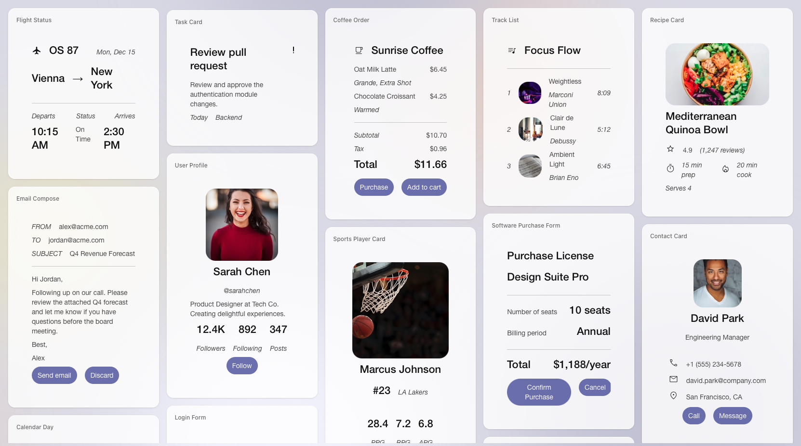

# A2UI：Agent-to-User Interface（智慧體到使用者介面）

A2UI 是一個開源專案，提供一套適合表達「可更新、由智慧體生成的 UI」的格式，以及初始渲染器集合，讓智慧體能夠生成或填入豐富的使用者介面。



*A2UI 渲染卡片的示例畫廊，展示它可以實現的多種介面組合。*

> **目前狀態：** 此目錄用於維護 A2UI 文件的繁體中文版本，文件樹結構與上游 `A2UI/docs/public` 保持一致。

## ⚠️ 狀態：早期公開預覽

> **說明：** A2UI 目前的正式發行版本是 **v0.9.1**，屬於穩定的 v0.9 協議家族中的一個修訂版。v1.0 規範目前是候選版本，v0.8 則已列為舊版。規範與實作已可使用，但仍持續演進中。我們開放此專案，是為了促進協作、收集回饋，並邀請社群貢獻（尤其是客戶端渲染器相關部分）。後續預期仍會有變更。

## 概述

生成式 AI 非常擅長產生文字與程式碼，但當智慧體需要向使用者呈現豐富且可互動的介面時，尤其是在智慧體遠端執行或跨越信任邊界的情境下，這件事就會變得困難。

**A2UI** 是一套開放標準與函式庫，讓智慧體可以「說 UI」。智慧體會送出描述 UI *意圖* 的宣告式 JSON，接著由客戶端應用程式使用自己的原生元件庫（Flutter、Angular、Lit 等）將其渲染出來。

這種方式讓智慧體生成的 UI 既像資料一樣安全，又像程式碼一樣具備表達力。

## 高層設計理念

A2UI 的設計目標，是解決智慧體生成式或範本式 UI 回應在跨平台、可互通情境中的關鍵問題。

專案的核心理念包括：

* **安全優先**：執行由 LLM 產生的任意程式碼可能帶來安全風險。A2UI 是宣告式資料格式，而不是可執行程式碼。你的客戶端應用會維護一份受信任、預先核准的 UI 元件「目錄」（例如 Card、Button、TextField），智慧體只能要求渲染目錄中已存在的元件。
* **對 LLM 友善且支援增量更新**：UI 以帶有 ID 參照的扁平元件列表表示，便於 LLM 逐步生成，因此天然適合漸進式渲染與反應迅速的使用體驗。隨著對話推進，智慧體可以根據新的使用者需求高效率地逐步修改 UI。
* **與框架無關且可攜**：A2UI 將 UI 結構與 UI 實作分離。智慧體送出元件樹描述及其關聯資料模型，客戶端應用負責把這些抽象描述對映到自身原生元件上，不論是 Web Components、Flutter Widgets、React Components，或 SwiftUI Views。來自智慧體的同一份 A2UI JSON，可以在不同框架建構的多個客戶端中渲染。
* **彈性**：A2UI 也提供開放式註冊表模式，允許開發者把伺服器端型別對映到自訂客戶端實作，從原生行動元件到 React 元件都可以。透過註冊「Smart Wrapper」，你可以把任何既有 UI 元件，包括用於承載舊系統內容的安全 iframe 容器，接入 A2UI 的資料繫結與事件系統。更重要的是，這讓安全控制權真正回到開發者手上，使你能在自訂元件邏輯中直接實施嚴格的沙箱策略與「信任階梯」，而不是只依賴核心系統。

## 用例

一些典型場景包括：

* **動態資料收集**：智慧體依據對話上下文（例如複雜預約場景）生成客製化表單，包括日期選擇器、滑桿與輸入欄位。
* **遠端子智慧體**：編排型智慧體把任務委派給遠端專業智慧體（例如旅遊預訂智慧體），後者回傳一段可在主聊天視窗中渲染的 UI 載荷。
* **自適應工作流程**：企業智慧體可根據使用者問題即時生成審批面板或資料視覺化介面。

## 架構

A2UI 明確區分「生成 UI」與「執行 UI」：

1. **生成**：智慧體（使用 Gemini 或其他 LLM）生成，或使用一份預先生成的 `A2UI Response`，也就是描述 UI 元件結構與其屬性的 JSON 載荷。
2. **傳輸**：該訊息被送到客戶端應用（透過 A2A、AG-UI 等）。
3. **解析**：客戶端中的 **A2UI Renderer** 解析這段 JSON。
4. **渲染**：Renderer 將抽象元件（例如 `type: 'text-field'`）對映到客戶端程式碼中的具體實作。

## 相依關係

A2UI 被設計為一種輕量格式，但它適用於更大的生態系：

* **傳輸層**：相容於 **A2A Protocol** 與 **AG-UI**。
* **LLM**：凡是能輸出 JSON 的模型，都可以生成 A2UI。
* **宿主框架**：需要使用受支援框架建立宿主應用（目前主要是 Web 或 Flutter）。

## 開始使用

依你想從哪裡切入，挑選對應的路徑：

| 路徑                                                                                                                          | 你會得到什麼                                                                                                                            | 時間   |
| ----------------------------------------------------------------------------------------------------------------------------- | --------------------------------------------------------------------------------------------------------------------------------------- | ------ |
| 🍜 **[Quickstart Restaurant Finder 示例](https://a2ui.org/quickstart/)**                                                      | 在本機執行完整的 A2UI 全端範例，搭配 Gemini 驅動的 ADK 智慧體與 Lit renderer。從頭到尾學習 A2UI，並依你的使用情境調整。 | ~5 分鐘 |
| ⚛️ **[在任意 Agent 框架與 Harness 中使用 A2UI](docs/public/guides/a2ui-with-any-agent-framework.md)**                     | 為你選定的框架或 Harness 建立 AG-UI 應用或 Harness 腳手架，接著在 AG-UI 之上啟用 A2UI 渲染。                                   | ~5 分鐘 |
| 🎨 **[A2UI Composer](https://a2ui-composer.ag-ui.com/)** · **[Widget Builder](https://go.copilotkit.ai/A2UI-widget-builder)** | 透過視覺化編輯器產生 A2UI JSON，貼到任何智慧體 prompt 中即可使用 — 不需安裝。                                                       | ~1 分鐘 |
| 🎬 **[A2UI Theater](https://a2ui-composer.ag-ui.com/theater)**                                                                | 逐步查看預先建置好的 A2UI 串流情境，涵蓋 Lit、React 與 Angular renderer — 不需安裝。                                         | ~1 分鐘 |

### Restaurant Finder 示例 — 摘要

前置條件：Node.js 18+（並啟用 [Corepack](https://nodejs.org/api/corepack.html)）、[uv](https://docs.astral.sh/uv/)，以及一組 [Gemini API 金鑰](https://aistudio.google.com/apikey)。

```bash
git clone https://github.com/a2ui-project/a2ui.git
cd a2ui
export GEMINI_API_KEY="your_gemini_api_key"

# 啟用 Corepack（macOS Homebrew 使用者請見下方提示）
corepack enable

yarn install
cd samples/client/lit
yarn demo:restaurant
```

> [!TIP]
> **macOS Homebrew 使用者：** 如果你先前安裝過獨立的套件管理工具，請先解除連結衝突再安裝 Corepack，讓 Corepack 能以專案為單位管理版本：
>
> ```bash
> brew unlink yarn pnpm
> brew install corepack
> corepack enable
> ```

以上指令會在各個 workspace 中安裝相依套件、建置 renderer、啟動 Python 智慧體，並在 `http://localhost:5173` 開啟客戶端。逐步操作說明、其他示例與疑難排解，請參閱 **[完整的 Quickstart](docs/public/quickstart.md)**。

### 在任意 Agent 框架與 Harness 中使用 A2UI — 摘要

```bash
npx create-ag-ui-app@latest
```

使用 AG-UI CLI 搭配你選定的框架或 Harness（Google Chat、ADK、LangGraph、CrewAI、Mastra、Strands、Slack、Teams 等），接著依照 **[AG-UI 指南](docs/public/guides/a2ui-with-any-agent-framework.md)** 啟用 A2UI 渲染。部分腳手架路徑底層是以 Next.js 搭配 [CopilotKit 的 A2UI runtime](https://docs.copilotkit.ai/generative-ui/a2ui) 實作，但整體設定介面仍以 AG-UI 為優先。

### 其他 Renderer

若你是 Flutter 開發者，可以參考 [GenUI SDK](https://github.com/flutter/genui)，它底層使用的就是 A2UI。完整的客戶端實作清單請見 [docs/public/reference/renderers.md](docs/public/reference/renderers.md)。

## 路線圖

我們希望和社群一起推進以下工作：

* **規範穩定化**：邁向 v1.0 規範。
* **更多渲染器**：增加對 React、Jetpack Compose、iOS（SwiftUI）等的官方支援。
* **更多傳輸方式**：支援 REST 等更多方式。
* **更多智慧體框架**：支援 Genkit、LangGraph 等。

## 貢獻

A2UI 採用 **Apache 2.0** 授權。我們相信 UI 的未來將是 agentic 的，也希望與你一起把它建構出來。

關於如何開始參與，請參閱 [CONTRIBUTING.md](CONTRIBUTING.md)。
