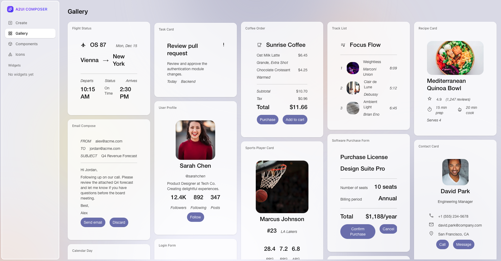

# A2UI Composer

透過 **CopilotKit A2UI Widget Builder**，以互動方式嘗試建構 A2UI 元件。

**[啟動 Widget Builder →](https://go.copilotkit.ai/A2UI-widget-builder)**

## 它能做什麼

- 以視覺化方式試驗 A2UI 元件
- 透過描述需求來生成 A2UI JSON
- 查看即時預覽
- 複製 JSON 並用在你的智慧體中

由 [CopilotKit](https://www.copilotkit.ai/) 團隊打造。
