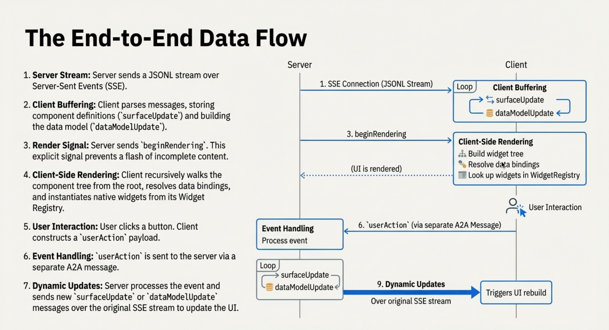

# 資料流

訊息如何從 Agent 流向 UI。

## 架構

```
Agent (LLM) → A2UI Generator → Transport (SSE/WS/A2A)
                                      ↓
Client (Stream Reader) → Message Parser → Renderer → Native UI
```



## 訊息格式

A2UI 定義了一連串描述 UI 的 JSON 訊息。當這些訊息以串流方式傳輸時，通常會格式化為 **JSON Lines (JSONL)**，也就是每一行都是一個完整的 JSON 物件。

=== "v0.8"

    ```jsonl
    {
      "surfaceUpdate": {
        "surfaceId": "main",
        "components": [...]
      }
    }
    {
      "dataModelUpdate": {
        "surfaceId": "main",
        "contents": [
          {
            "key": "user",
            "valueMap": [
              { "key": "name", "valueString": "Alice" }
            ]
          }
        ]
      }
    }
    {
      "beginRendering": {
        "surfaceId": "main",
        "root": "root-component"
      }
    }
    ```

=== "v0.9"

    ```jsonl
    {
      "version": "v0.9",
      "createSurface": {
        "surfaceId": "main",
        "catalogId": "https://a2ui.org/specification/v0_9/basic_catalog.json"
      }
    }
    {
      "version": "v0.9",
      "updateComponents": {
        "surfaceId": "main",
        "components": [...]
      }
    }
    {
      "version": "v0.9",
      "updateDataModel": {
        "surfaceId": "main",
        "path": "/user",
        "value": { "name": "Alice" }
      }
    }
    ```

**為什麼要用這種格式？**

由彼此獨立的 JSON 物件所組成的序列，對串流相當友善，LLM 可以很容易逐步產生，而且即使中途出錯也比較有韌性。

## 生命週期範例：餐廳訂位

**使用者：** "Book a table for 2 tomorrow at 7pm"

=== "v0.8"

    **1. Agent 定義 UI 結構：**

    ```json
    {
      "surfaceUpdate": {
        "surfaceId": "booking",
        "components": [
          {
            "id": "root",
            "component": {
              "Column": {
                "children": {
                  "explicitList": ["header", "guests-field", "submit-btn"]
                }
              }
            }
          },
          {
            "id": "header",
            "component": {
              "Text": {
                "text": { "literalString": "Confirm Reservation" },
                "usageHint": "h1"
              }
            }
          },
          {
            "id": "guests-field",
            "component": {
              "TextField": {
                "label": { "literalString": "Guests" },
                "text": { "path": "/reservation/guests" }
              }
            }
          },
          {
            "id": "submit-btn",
            "component": {
              "Button": {
                "child": "submit-text",
                "action": {
                  "name": "confirm",
                  "context": [
                    { "key": "details", "value": { "path": "/reservation" } }
                  ]
                }
              }
            }
          }
        ]
      }
    }
    ```

    **2. Agent 填入資料：**

    ```json
    {
      "dataModelUpdate": {
        "surfaceId": "booking",
        "path": "/reservation",
        "contents": [
          { "key": "datetime", "valueString": "2025-12-16T19:00:00Z" },
          { "key": "guests", "valueString": "2" }
        ]
      }
    }
    ```

    **3. Agent 發出開始渲染訊號：**

    ```json
    {
      "beginRendering": {
        "surfaceId": "booking",
        "root": "root"
      }
    }
    ```

    **4. 使用者將 guests 改成 "3"** → Client 會自動更新 `/reservation/guests`

    **5. 使用者點擊 "Confirm"** → Client 傳送 action：

    ```json
    {
      "userAction": {
        "name": "confirm",
        "surfaceId": "booking",
        "context": {
          "details": {
            "datetime": "2025-12-16T19:00:00Z",
            "guests": "3"
          }
        }
      }
    }
    ```

    **6. Agent 回應** → 更新 UI 或送出：

    ```json
    { "deleteSurface": { "surfaceId": "booking" } }
    ```

=== "v0.9"

    **1. Agent 建立 surface：**

    ```json
    {
      "version": "v0.9",
      "createSurface": {
        "surfaceId": "booking",
        "catalogId": "https://a2ui.org/specification/v0_9/basic_catalog.json"
      }
    }
    ```

    **2. Agent 定義 UI 結構：**

    ```json
    {
      "version": "v0.9",
      "updateComponents": {
        "surfaceId": "booking",
        "components": [
          {
            "id": "root",
            "component": "Column",
            "children": ["header", "guests-field", "submit-btn"]
          },
          {
            "id": "header",
            "component": "Text",
            "text": "Confirm Reservation",
            "variant": "h1"
          },
          {
            "id": "guests-field",
            "component": "TextField",
            "label": "Guests",
            "value": { "path": "/reservation/guests" }
          },
          {
            "id": "submit-btn",
            "component": "Button",
            "child": "submit-text",
            "variant": "primary",
            "action": {
              "event": {
                "name": "confirm",
                "context": {
                  "details": { "path": "/reservation" }
                }
              }
            }
          }
        ]
      }
    }
    ```

    **3. Agent 填入資料：**

    ```json
    {
      "version": "v0.9",
      "updateDataModel": {
        "surfaceId": "booking",
        "path": "/reservation",
        "value": {
          "datetime": "2025-12-16T19:00:00Z",
          "guests": "2"
        }
      }
    }
    ```

    **4. 使用者將 guests 改成 "3"** → Client 會自動更新 `/reservation/guests`

    **5. 使用者點擊 "Confirm"** → Client 會傳送 action：

    ```json
    {
      "version": "v0.9",
      "action": {
        "name": "confirm",
        "surfaceId": "booking",
        "context": {
          "details": {
            "datetime": "2025-12-16T19:00:00Z",
            "guests": "3"
          }
        }
      }
    }
    ```

    **6. Agent 回應** → 更新 UI 或送出：

    ```json
    {
      "version": "v0.9",
      "deleteSurface": { "surfaceId": "booking" }
    }
    ```

## 傳輸選項

A2UI 與傳輸層無關 - 任何能夠傳遞 JSON 訊息的機制都可以：

- **[A2A Protocol](https://a2a-protocol.org/)**：標準化的 agent-to-agent 通訊，也可用於 agent-to-UI 傳遞
- **[AG UI](https://docs.ag-ui.com/)**：雙向、即時的 agent-UI 協定
- **REST / HTTP**：簡單的 request-response，或使用 Server-Sent Events (SSE) 做單向串流
- **WebSocket**：持續性的雙向連線，適合即時更新與使用者操作
- **其他任何傳輸**：gRPC、訊息佇列、自訂協定 - 只要能帶 JSON，就能用

實作細節請參閱 [transports](transports.md)。

## 漸進式渲染

與其等整個回應都生成完才顯示給使用者，不如在內容產生時就把回應區塊串流到 client，並逐步渲染。

使用者看到的是即時建構中的 UI，而不是一直看著轉圈圈。

## 錯誤處理

- **格式錯誤的訊息：** 跳過並繼續，或把錯誤回傳給 Agent 以便修正
- **網路中斷：** 顯示錯誤狀態、重新連線、由 Agent 重新送出或續傳

## 效能

- **批次處理：** 將更新緩衝 16ms，合併後一起渲染
- **Diffing：** 比較舊/新元件，只更新變更過的屬性
- **細粒度更新：** 更新 `/user/name`，而不是整個 `/` 模型
