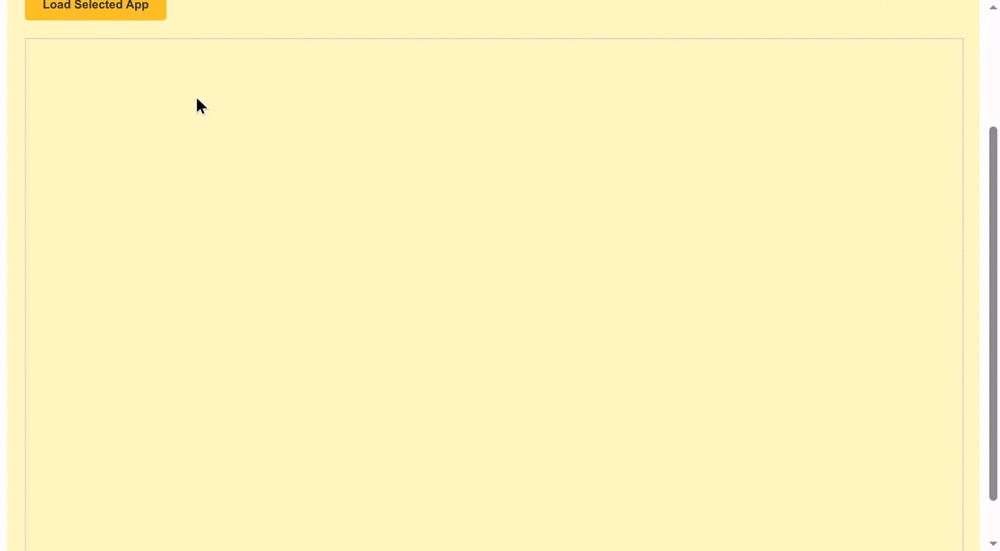
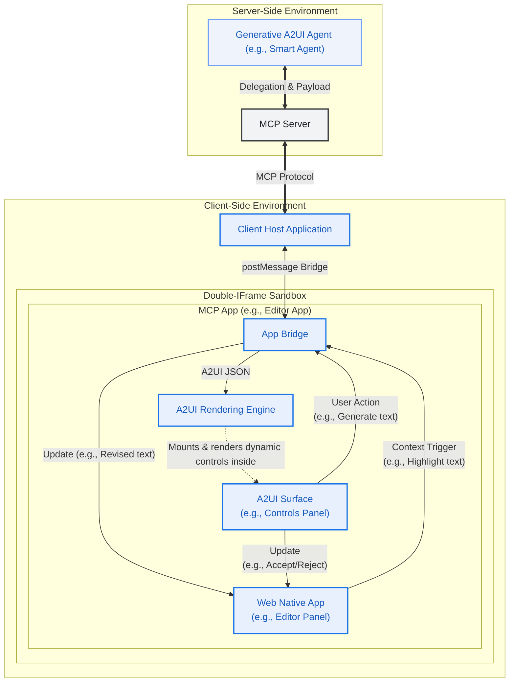
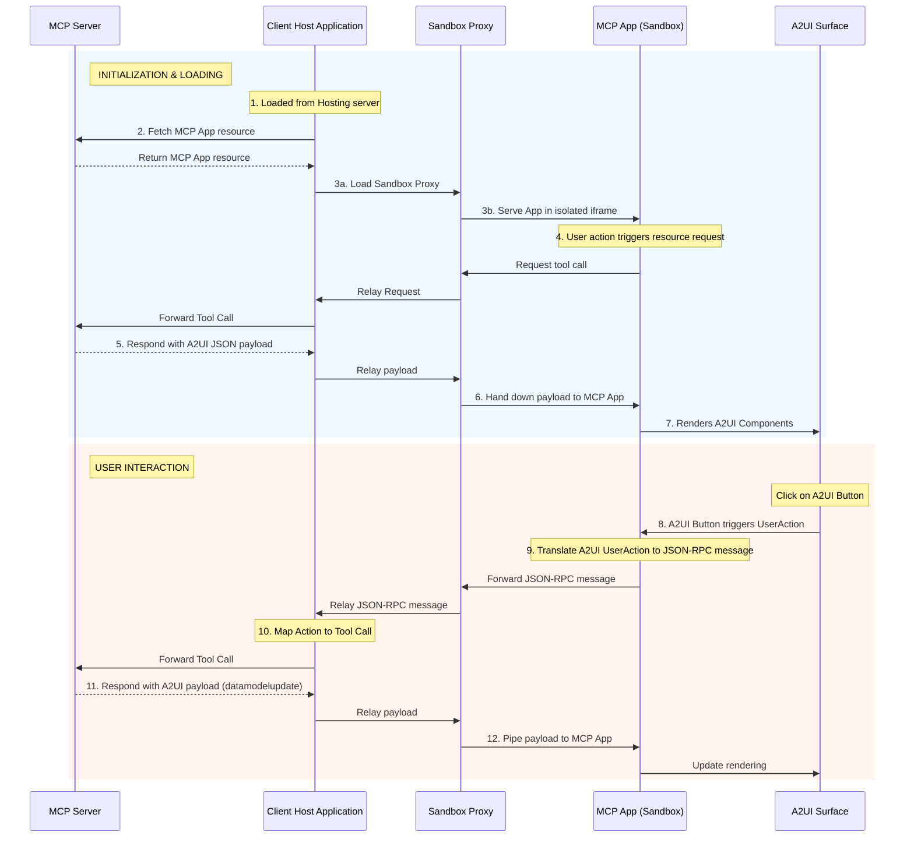

# 在 MCP Applications 中動態渲染 A2UI

本指南展示如何使用 Tools 和 Embedded Resources，在 [MCP Apps](https://modelcontextprotocol.io/extensions/apps/overview) 中提供丰富、互動式的 A2UI 介面。完成後，你將擁有一個可工作的 MCP server，它會傳回一個能夠渲染 A2UI 元件並處理 A2UI 互動的 MCP App。透過在 MCP Apps 中支援原生 A2UI，你的 MCP server 可以在維持 UI 樣式一致性的同時，與遠程 agent 安全協作。



## 前置條件

- **[Python 3.10+](https://www.python.org/)**
- **[uv](https://docs.astral.sh/uv/)** — 快速 Python 包管理器
- **[Node.js 18+](https://nodejs.org/)**（用於 MCP Inspector）

## 快速開始：執行範例

關於如何執行此範例的詳細說明，請參閱 [README.md](https://github.com/google/A2UI/blob/main/samples/mcp/a2ui-in-mcpapps/README.md)。

## 架構概覽

系統由三個主要參與者組成，它們透過一條通訊链路互動：

1.  **客戶端宿主應用**：外層容器（例如 Angular app），連接到 MCP Server，並為 MCP App 承載安全 sandbox。
2.  **MCP 應用（沙箱化）**：不可信的第三方 Web 應用（例如 Lit 或 Angular micro-app），執行在雙 iframe sandbox 中。該 app 內包含 A2UI surface。
3.  **MCP Server**：提供應用資源並處理 tool call 的後端 server。



## 深入：通訊流程

這個模式的關鍵點是 **MCP App** 會直接渲染 A2UI payload，而不是依賴 Client Host Application 來渲染。

### 在 MCP Apps 中加載 A2UI 元件

下面是將 A2UI 元件動態加載到 MCP Apps 中的事件序列：

1.  **Trigger**：MCP App 決定需要取得或更新 UI 內容（例如初始化時，或透過使用者發起的 Action）。
2.  **Request**：MCP App 透過 `window.parent.postMessage` 向 Host 送出 JSON-RPC 請求。
    - _範例 Method_：`ui/fetch_counter_a2ui`
3.  **Relay**：Sandbox Proxy 將該訊息轉發給 Client Host。
4.  **MCP Call**：Client Host 將這個自訂訊息轉換為標準 MCP `tools/call` 請求，並送出給 MCP Server。
    - _範例 Tool_：`fetch_counter_a2ui`
5.  **Response**：MCP Server 執行 tool，並傳回包含 `application/json+a2ui` resource 的結果。
6.  **回應轉發**：Host 收到 tool result，並透過 Sandbox Proxy 向下轉發回 MCP App。
7.  **渲染**：MCP App 從 resource 中提取 A2UI JSON payload，並送入本機 A2UI `MessageProcessor`，從而動態更新 A2UI surface。

### 處理使用者 Action

渲染出的 A2UI surface 內的互動透過反向流程處理：

1.  使用者點擊 MCP App 內 A2UI surface 中的按鈕。
2.  A2UI 元件觸發 `userAction`。
3.  MCP App 透過 A2UI `MessageProcessor.events` 訂閱捕獲該事件。
4.  MCP App 打包 action，並以 JSON-RPC 訊息形式送出給 Host（例如 `ui/increase_counter`）。
5.  Host 呼叫 MCP Server 上對應的 tool。
6.  Server 傳回新的 A2UI payload（表示更新後的狀態），該 payload 會被管道式傳回 MCP App 以更新渲染。

### 時序圖



## 如何實作

要建構具備 A2UI 能力的 MCP App，請按以下步驟操作：

### 第 1 步：內聯 Renderer

MCP Apps 通常作為單一 HTML resource 從 MCP Server 交付。要用 Angular 或 React 這樣的現代框架實作這一點：

1.  正常建構你的應用，產出靜態資源（`index.html`、`.js`、`.css`）。
2.  使用建構後腳本（例如範例中的 [`inline.js`](https://github.com/google/A2UI/blob/main/samples/mcp/a2ui-in-mcpapps/server/apps/src/inline.js) 腳本）讀取 `index.html`，並把外部 `<script src="...">` 與 `<link rel="stylesheet" href="...">` 標籤替換為內聯 `<script>` 與 `<style>` 標籤，內容為實際檔案內容。
3.  這樣會生成一個自包含 HTML 檔案，可以透過受限 iframe 的 `srcdoc` 安全加載。

> [!TIP]
> **使用 Vite 內聯**
>
> 如果專案使用 Vite（React、Vue 或 Lit 中常見），可以用 `vite-plugin-singlefile` 等插件自動實作相同的單檔案輸出。它會在建構過程中處理內聯，免去自訂建構後腳本。
>
> **使用方式：**
>
> 1. **安裝插件**：
>
>     ```bash
>     npm install -D vite-plugin-singlefile
>     ```
>
> 2. **設定 Vite**：將插件加入 `vite.config.ts`（或 `.js`）：
>
>     ```typescript
>     import {defineConfig} from 'vite';
>     import {viteSingleFile} from 'vite-plugin-singlefile';
>
>     export default defineConfig({
>       plugins: [viteSingleFile()],
>     });
>     ```
>
>     這樣會確保建構時所有 JS 和 CSS 資源都內聯進 `index.html`，使其可作為單一 resource 由 MCP server 提供。

### 第 2 步：利用 A2UI-over-MCP

內聯 app 現在已在 sandbox 中執行。要利用 A2UI：

1.  將 **A2UI Angular/Lit 庫** 包含進 app bundle。
2.  與 Host 定義通訊契約，以便與 MCP Server 互動。
3.  收到 Host 回應後，在 content 中查找 `application/json+a2ui` mimeType。
4.  解析 JSON 文本，並傳給 A2UI [`MessageProcessor`](https://github.com/google/A2UI/blob/main/renderers/angular/src/v0_8/data/processor.ts)。

**範例：取得並渲染 A2UI**

```typescript
// 1. Request A2UI data from Host
const result = await callHostMethod('ui/fetch_counter_a2ui');

// 2. Find and parse the A2UI resource
const a2uiResource = result.find(
  c => c.type === 'resource' && c.resource?.mimeType === 'application/json+a2ui',
);

if (a2uiResource?.resource?.text) {
  const messages = JSON.parse(a2uiResource.resource.text);
  this.processor.processMessages(messages);
}

// Utility for JSON-RPC communication
function callHostMethod(method: string, params: any = {}): Promise<any> {
  return new Promise((resolve, reject) => {
    const requestId = `${method}-${Date.now()}`;

    const handler = (event: MessageEvent) => {
      if (event.data.id !== requestId) return;
      window.removeEventListener('message', handler);

      if (event.data.error) {
        reject(event.data.error);
      } else {
        resolve(event.data.result);
      }
    };

    window.addEventListener('message', handler);

    window.parent.postMessage(
      {
        jsonrpc: '2.0',
        id: requestId,
        method,
        params,
      },
      '*',
    ); // Note: Replace "*" with explicit target origin in production
  });
}
```

### 第 3 步：處理 A2UI 元件上的使用者 Action

要處理渲染出的 A2UI surface 內部互動，MCP App 必須捕獲 A2UI event，並使用 JSON-RPC 將其轉發給 Host。

**範例：處理使用者 Action**

```typescript
// Subscribing to A2UI events in the MCP App ([main.ts](https://github.com/google/A2UI/blob/main/samples/mcp/a2ui-in-mcpapps/server/apps/src/src/main.ts))
this.processor.events.subscribe(async event => {
  if (!event.message.userAction) return;

  const method = `ui/${event.message.userAction.name}`;
  const params = event.message.userAction.context;

  try {
    // Translate A2UI UserAction to JSON-RPC, send to Host, and await response
    const result = await callHostMethod(method, params);

    // Parse the updated A2UI payload and update the rendering
    const messages = extractA2UIMessages(result);
    if (messages) {
      this.processor.processMessages(messages);
    }
  } catch (error) {
    console.error(`Error handling user action[${method}]:`, error);
  }
});
```

這種模式讓 MCP App 能作為 MCP Server A2UI 能力的動態介面，同時維持嚴格的安全隔離。

### 內聯 MCP App HTML 偽程式碼

把這些內容放在一起，下面是一個 HTML mockup，表示已編譯並內聯的 MCP Application。它使用原生 `<a2ui-surface>` 元素定義占位 UI，初始化 `AppBridge` 與外層 host 通訊，在加載時取得動態 A2UI layout，並使用已加載的 A2UI SDK 處理事件：

```html
<!DOCTYPE html>
<html lang="en">
  <head>
    <meta charset="UTF-8" />
    <title>Inlined MCP App Surface</title>
    <!-- Assumes the standard A2UI SDK script is bundled or loaded -->
  </head>
  <body>
    <div>
      <h3>MCP App (Editor Panel)</h3>
      <p>This text is native to the sandboxed third-party app.</p>

      <!-- A2UI Surface custom element provided by the A2UI SDK -->
      <a2ui-surface surfaceId="recipe-card"></a2ui-surface>
    </div>

    <script>
      // Note: The pseudocode below assumes AppBridge from @modelcontextprotocol/ext-apps
      // and a2uiProcessor from the A2UI SDK are preloaded or inlined.
      const bridge = new AppBridge({name: 'editor-panel', version: '1.0.0'});

      // Helper to extract and process dynamic A2UI responses from tool results
      function processA2UIResponse(result) {
        const a2uiResource = result?.content?.find(
          c => c.type === 'resource' && c.resource?.mimeType === 'application/json+a2ui',
        );
        if (a2uiResource?.resource?.text) {
          const payload = JSON.parse(a2uiResource.resource.text);
          window.a2uiProcessor.processMessages(payload);
        }
      }

      // 1. Initialize AppBridge and fetch initial controls
      async function initApp() {
        await bridge.connect();

        // Call server tool to load initial layout controls
        const result = await bridge.callServerTool({name: 'fetch_controls', arguments: {}});
        processA2UIResponse(result);
      }

      // 2. Handle interactive User Actions routed by the A2UI SDK
      window.a2uiProcessor.events.subscribe(async event => {
        if (!event.message.userAction) return;
        const action = event.message.userAction;

        // Route the user action directly via the bridge to the MCP Server tool
        const result = await bridge.callServerTool({
          name: action.name,
          arguments: action.context,
        });

        // Feed any updated server UI states back to the A2UI processor
        processA2UIResponse(result);
      });

      // Initialize the app on startup
      initApp();
    </script>
  </body>
</html>
```

## 安全注意事項

- **顯式 Target Origin**：呼叫 `postMessage` 時，如果已知 host origin，始終使用具體 target origin（例如 `'https://trusted-host.com'`），而不是 `*`。這可以防止惡意 iframe 攔截 RPC 請求。
- **Null Origin 處理**：請記住，在嚴格 sandbox（`sandbox="allow-scripts"` 且沒有 `allow-same-origin`）內部，`window.location.origin` 會求值為 `"null"`。必須透過比較 `event.source` 與預期 window 物件（例如 `window.parent`）來謹慎驗證傳入訊息。
