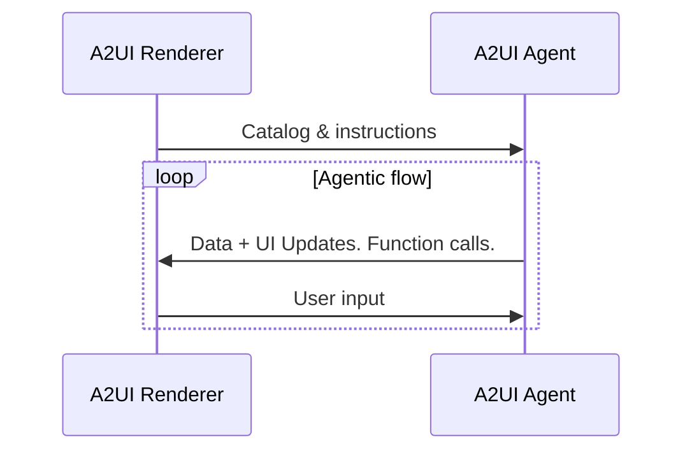
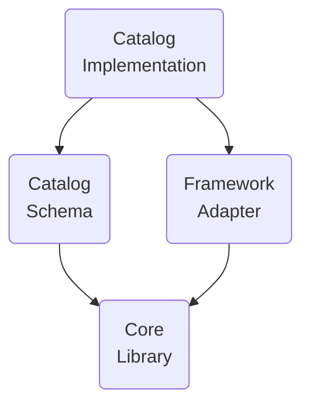

# 術語表

## A2UI 協議術語

A2UI 協議要求使用的術語。

### A2UI agent 與 A2UI renderer

A2UI 協議支援 **agent** 與 **renderer** 之間的對話：

1. **Renderer** 以 A2UI catalog 的形式提供 **UI 能力**，並提供如何使用這些能力的 **instructions**。
2. **Agent** 在循環中迭代：
    - 在考慮收到的 catalog 後，提供要呼叫的 **UI** 和 **functions**
    - 接收由 renderer 傳達的 **使用者輸入**
    - 更新要顯示在 UI 中的 **資料**

雖然協議面向 **AI 增強型 agent** 設計，但它也可以與確定性的 agent 一起工作。例如，agent 可以傳回預先準備好的 A2UI UI。

如果 agent 是無狀態的，或不保證保留 catalog，renderer 應在每條訊息中都提供 catalog。

有時 agent 會使用預定義 catalog，這會要求 renderer 要么支援該 catalog，要么使用適配器。

### GenUI Component

允許 agent 使用的 UI 元件。例如：日期選擇器、輪播、按鈕、酒店選擇器。

### Catalog

1. 逐項列出的 renderer 能力：
    - agent 可用於生成 UI 的元件清單
    - renderer 可呼叫的函式清單
    - 樣式和主題
2. 關於這些 renderer 能力應如何使用的說明。

可以觀察到，不同使用場景下，catalog 元件可能與領域關聯得更弱或更強：

- **更通用**：

    按鈕、標籤、行、列、選項選擇器等基礎 UI 原語。

- **更領域化**：

    類似 HotelCheckout 或 FlightSelector 的元件。

### Basic Catalog

由 A2UI 團隊維護的 catalog，用於快速開始使用 A2UI。

參見 [basic catalog](../specification/v1_0/catalogs/basic/catalog.json)。

### Surface

由 A2UI agent 構造、由 A2UI renderer 管理的一塊 UI 區域，由多個元件組成。Surface 不能嵌套。

### Agent 架構

A2UI agent 有多種選項：

- **同進程或伺服端**：

    Agent 與 renderer 可以位於客戶端應用的同一進程中。例如：桌面 Flutter 應用。

    或者，renderer 可以位於顯示 UI 的機器上，而 agent 位於另一台機器（伺服器）上。

- **Orchestrator agent**：

    中央 orchestrator 管理使用者與多個專門 sub-agent 之間的互動。Orchestrator 可以在同一進程中，也可以在伺服器上。

- **拉取 / 推送**：

    Agent 可以等待來自 renderer 的訊息/請求，也可以主動向 renderer 推送訊息/請求。

- **有狀態 / 無狀態**：

    Agent 可以保留狀態，也可以是無狀態的。

- **與其他協議混合使用**：

    A2UI 可以與其他協議組合使用。例如，agent 可以是 MCP 和/或 A2A server。

- **其他變體**：

    除上述選項外，也可以采用任意自訂變體。

### Renderer 棧

A2UI renderer 的功能由可獨立開發並複用的層組成：

- **Core Library**：

    描述 catalog 以及與 agent 互動所需的一組原語。

    例如，參見 [JavaScript web core library](../../../renderers/web_core/README.md)。

- **Catalog Schema**：

    以 JSON 形式定義 catalog。

    例如，參見 [basic catalog schema](../specification/v1_0/catalogs/basic/catalog.json)。

- **Framework adapter**：

    在具體框架中實作 agent 指令執行的程式碼。例如：
    - JavaScript core 與 catalog 可以適配 Angular、Electron、React 和 Lit 框架。
    - Dart core 與 catalog 可以適配 Flutter 和 Jaspr 框架。

    參見 [Angular adapter](../../../renderers/angular/README.md)。

- **Catalog Implementation**：

    某個框架對 catalog schema 的實作。

    例如：
    - 參見 [Angular 對 basic catalog 的實作](../../../renderers/angular/src/v0_9/catalog/basic)

### A2UI message

Agent 與 renderer 之間的訊息。

由於協議允許流式傳輸，任何訊息都可以是已結束（完全交付）或未結束（部分交付）。已結束的訊息可以是已完成（成功交付），也可以是被中斷（因技術問題停止交付）。

參見 [資料流指南](data-flow.md)。

### Agent turn

Agent 在開始等待使用者輸入之前送出的一組訊息。

### Data model

Renderer 與 agent 共享、雙方都可更新的可觀察、層級式、類 JSON 物件。每個 Surface 都有獨立的 Data Model。

元件可以繫結到 data model 的節點上，以便在值發生變化時自動更新。

Data model 透過把使用者互動捕獲到狀態物件中並傳給 agent，同時允許 agent 將資料更新推回 UI，從而實作雙向同步。

參見 [資料繫結指南](data-binding.md)。

### Data reference

在元件定義中，對某個資料元素的引用；該引用可以透過 data model 中的路徑解析，也可以按值解析。

參見 [basic catalog 中的範例](../specification/v1_0/catalogs/basic/catalog.json#L18)。

### Client function

供 agent 在需要時呼叫的函式。

不要與 LLM tool 混淆：

| 特性      | Client Function                                                       | LLM Tool Invocation                                                                   |
| --------- | --------------------------------------------------------------------- | ------------------------------------------------------------------------------------- |
| 執行者    | A2UI Renderer                                                         | LLM 請求呼叫，不關心執行細節。                                                       |
| 時機      | Agent 到 renderer 的訊息送出之後。                                    | Agent 到 renderer 的訊息送出之前。                                                    |
| 目的      | UI 逻輯（驗證、可見性切換、格式化）                                   | 推理、資料取得、後端操作                                                              |
| 定義      | 注冊在客戶端函式注冊表中，並在 catalog 中宣告                         | 定義在 ToolDefinition 中（傳給 LLM）                                                  |
| 狀態存取  | 可存取 DataContext 和輸入值。                                         | 不能存取用於觸發 AI 的請求。可存取外部 API、資料庫和服務                              |

參見 [common types 中的範例](../specification/v0_9/json/common_types.json#L200)。

### Action

由使用者在 UI 中觸發的互動容器。Action 分為兩類：

- **Event**：派發給 agent 處理（例如點擊“Submit”）。
- **Function**：在 renderer 本機執行（例如開啟 URL）。

參見 [actions 詳細指南](actions.md)。

## 生成式 UI 術語

這些術語不是 A2UI 協議必需的，但在生成式 UI 語境中常用。

### GenUI 的已知模式

- **Chat**：

    生成的 UI 片段按時間順序逐個出現在可垂直滾動的區域中，並與使用者輸入混合顯示。

- **Canvas**：

    與 agent 協作的空間。

- **Dashboard**：

    生成的 UI 片段不是按時間，而是按含義組織，並穩定地（也稱 pinned）停留在使用者期望看到的位置。

- **Wizard**：

    生成的 UI 片段逐個顯示，目標是收集某項任務所需的資訊。

### NoAI information

被歸類為 **AI 不可存取** 的資訊（例如信用卡資訊）。

哪些資訊不應被 AI 存取由應用所有者定義，並且在 **不同上下文中不同**。例如，在某些上下文中，病史絕不能進入 AI；而在另一些上下文中，AI 會大量用於輔助醫療診斷，因此需要病史。

這個術語在 GenUI 語境中很重要，因為最終使用者希望 **清楚看到** 自己輸入的哪些內容允許傳給 AI，哪些內容不允許。
