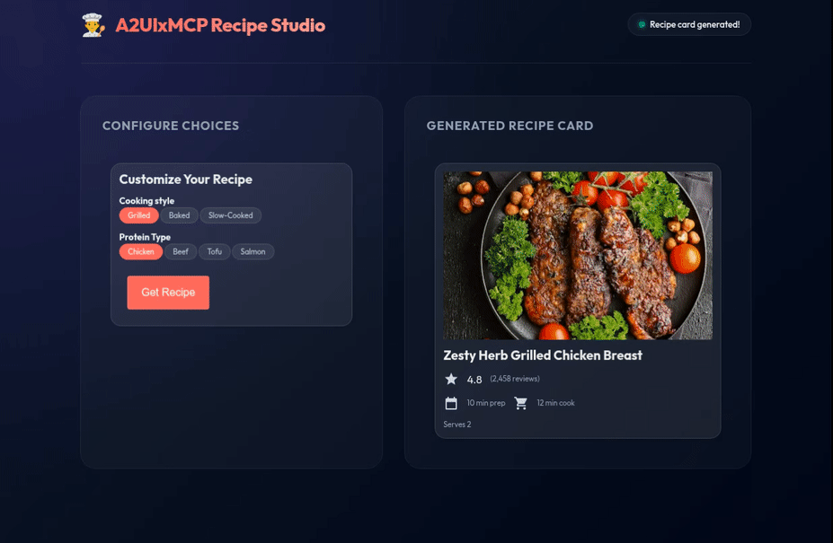

# 透過 Model Context Protocol (MCP) 使用 A2UI

本指南說明如何透過 **MCP server**，使用 Tools 與 Embedded Resources 提供**豐富且可互動的 A2UI 介面**。完成後，你將擁有一個可運作的 MCP server，能把 A2UI 元件回傳給任何相容 MCP 的 client。

<video width="100%" height="auto" controls playsinline style="display: block; aspect-ratio: 16/9; object-fit: cover; border-radius: 8px; margin-bottom: 24px;">
  <source src="../assets/guides-a2ui-over-mcp-tour.mp4" type="video/mp4">
  你的瀏覽器不支援 video 標籤。
</video>

## 前置條件

開始之前，請確認已安裝以下項目：

- **Python**（3.10 版或以上）。
- **[uv](https://docs.astral.sh/uv/)**，用於快速的 Python 套件管理。
- **Node.js**（18 版或以上），供 MCP Inspector 使用。

## 快速開始：執行範例

在深入協議細節之前，先讓一個可運作的範例跑起來。A2UI 倉庫內建了一個現成的 MCP recipe 示範。

```bash
# 複製倉庫（如果尚未複製）
git clone https://github.com/a2ui-project/a2ui.git
cd a2ui/samples/mcp/a2ui-over-mcp-recipe

# 啟動 MCP server（SSE transport，port 8000）
uv run .
```

### 選項 A：透過 MCP Inspector 互動

在另一個終端機中，啟動 [MCP Inspector](https://github.com/modelcontextprotocol/inspector) 來與 server 互動：

```bash
npx @modelcontextprotocol/inspector
```

在 Inspector 中：

1. 將 **Transport Type** 設為 `SSE`
2. 連線到 `http://localhost:8000/sse`
3. 點擊 **List Resources** → 你會看到「Recipe Form」resource。
4. 讀取 `a2ui://recipe-form` resource → 其內容就是用來渲染簡單表單的 A2UI JSON。
5. 點擊 **List Tools** → 你會看到 `get_recipe_a2ui`
6. 執行該 tool → 回應內容就是用來渲染食譜卡片的 A2UI JSON

> NOTE: 附註
>
> 這個範例使用本機路徑參照 A2UI Agent SDK。若用於你自己的專案，請改從 PyPI 安裝：
>
> ```bash
> pip install a2ui-agent-sdk
> ```

### 選項 B：執行 Recipe Client Web App

如果想要以完整互動、視覺化的方式體驗 A2UI over MCP，可以執行內建的 web 應用：

> [!NOTE]
> **套件管理工具的使用：** 在 A2UI 倉庫內執行內建的範例應用程式，需要使用 Yarn（`yarn install` / `yarn dev`），因為這是透過 Corepack workspaces 設定的。若是在此倉庫之外的一般日常使用與獨立專案中，可以自由選擇你偏好的套件管理工具（例如 npm、pnpm）。

1. 在新的終端機視窗中，切換到 client 目錄：
    ```bash
    cd client
    ```
2. 安裝 Node.js 相依套件：
    ```bash
    yarn install
    ```
3. 啟動 Vite 開發伺服器：
    ```bash
    yarn dev
    ```
4. 在瀏覽器中開啟終端機顯示的網址（通常是 `http://localhost:5173`）。

你會看到一個精緻、具回應式設計的雙欄介面：左欄會從 MCP resource（`a2ui://recipe-form`）渲染選擇表單。選擇選項並點擊 **「Get Recipe」** 會執行 MCP tool（`get_recipe_a2ui`），並在右欄動態渲染回傳的自訂 A2UI 食譜卡片。



所有範例請見 [`samples/community/mcp/`](../../../samples/community/mcp)。

## 運作原理

MCP server 有兩種主要方式可以把 A2UI 內容送到 client：

1. **透過讀取 Resource（`resources/read`）**：client 直接讀取 MCP resource（例如 `a2ui://recipe-form`）。server 直接回傳 A2UI JSON payload。
2. **透過呼叫 Tool（`tools/call`）**：client 呼叫 MCP tool（例如 `get_recipe_a2ui`）。server 會把 A2UI JSON payload 包裝成 **Embedded Resource**，放進 tool 回應中回傳。

不論哪一種方式，client 都會偵測 `application/a2ui+json` 這個 MIME type，並將 payload 導向 A2UI renderer。

> [!IMPORTANT]
> **MIME Type 的一致性**
> 不論交付管道為何（無論是直接以 Resource 讀取，或包裝在 Tool 的 `CallToolResult` 中回傳），A2UI JSON payload 一律以 `application/a2ui+json` 這個 MIME type 標示。在 Tool 回應中，payload 必須包裝在帶有這個 MIME type 的 `EmbeddedResource` 裡。這種一致的標示方式，讓 client 端的中介層可以無縫攔截靜態 resource 與動態 tool 回應，並統一導向 A2UI 處理。

### 1. 以 Resource 為基礎的交付流程（`resources/read`）

```
Client → resources/read → MCP Server
                             ↓
                 Retrieve A2UI JSON
                             ↓
Client ← ResourceContents ← MCP Server
          (application/a2ui+json)
   ↓
A2UI Renderer displays UI
```

### 2. 以 Tool 為基礎的交付流程（`tools/call`）

```
Client → tools/call → MCP Server
                         ↓
              Generate A2UI JSON
                         ↓
         Wrap as EmbeddedResource
              (application/a2ui+json)
                         ↓
Client ← CallToolResult ← MCP Server
   ↓
A2UI Renderer displays UI
```

## Resources 與 Tools：用途劃分

在設計透過 MCP 整合 A2UI 時，應該依據 UI payload 是靜態還是動態，來選擇使用 **Resources** 或 **Tools**。

### 1. 透過 MCP Resources 提供靜態 UI（`resources/read`）

對於不依賴使用者提示輸入或對話歷史的簡單靜態使用者介面，應該直接以 MCP Resource 的形式提供 A2UI。

- **概念**：client 使用標準 resource URI（例如 `a2ui://recipe-form`）讀取預先定義好的 A2UI resource。
- **使用情境**：非常適合靜態設定表單、選擇畫面、設定儀表板，或固定版面配置。
- **優點**：實作非常簡單、額外開銷低，且不需要 LLM／agent 呼叫 tool 才能取得結構。

**Python Server 範例：**

```python
@app.list_resources()
async def list_resources() -> list[types.Resource]:
    return [
        types.Resource(
            uri="a2ui://recipe-form",
            name="Recipe Form",
            mimeType="application/a2ui+json",
            description="Static form allowing users to pick options.",
        )
    ]

@app.read_resource()
async def read_resource(uri: str) -> list[ReadResourceContents]:
    if uri == "a2ui://recipe-form":
        return [
            ReadResourceContents(
                content=json.dumps(recipe_form_json),
                mime_type="application/a2ui+json",
            )
        ]
    raise ValueError(f"Unknown resource: {uri}")
```

### 2. 透過 MCP Tools 提供動態 UI（`tools/call`）

對於需要根據對話上下文、使用者參數或即時資料動態產生的使用者介面，應該把 A2UI 放進 MCP Tool 的回應中提供。

- **概念**：client／agent 帶著特定引數（例如選定的食材、偏好設定）呼叫 tool，server 則回傳一份客製化的 A2UI JSON，包裝在 `CallToolResult` 的 `EmbeddedResource` 中。
- **使用情境**：非常適合依賴即時資料庫查詢、先前輸入、互動式逐步精靈狀態，或個人化推薦（例如客製化的食譜卡片）等內容。
- **優點**：最大化彈性與情境感知能力，並支援高度動態的流程。
- **最佳實踐（Fallback 文字）**：務必在 `CallToolResult` 中，於 `EmbeddedResource` 旁附上 `TextContent`。不支援 A2UI 的 client 會退回顯示這段文字給使用者。

**Python Server 範例：**

```python
@app.call_tool()
async def handle_call_tool(name: str, arguments: dict[str, Any]) -> types.CallToolResult:
    if name == "get_recipe_a2ui":
        # Resolve dynamic selections from client parameters
        style = arguments.get("cookingStyle", "Baked")
        protein = arguments.get("protein", "Salmon")

        # Retrieve customized recipe database entry
        recipe_data = RECIPES.get((style, protein))

        # Customize base A2UI schema dynamically
        custom_recipe_json = copy.deepcopy(recipe_a2ui_json)
        custom_recipe_json[1]["updateComponents"]["components"][0]["text"] = recipe_data["title"]

        # Return customized recipe card as EmbeddedResource
        return types.CallToolResult(content=[
            types.EmbeddedResource(
                type="resource",
                resource=types.TextResourceContents(
                    uri="a2ui://recipe-card",
                    mimeType="application/a2ui+json",
                    text=json.dumps(custom_recipe_json),
                )
            )
        ])
```

## 目錄協商

在 server 能夠傳送 A2UI 給 client 之前，雙方必須先確定有哪些 catalog 可用。依照你的架構，這可以透過以下兩種方式之一完成。

### 選項 A：在 MCP 初始化期間進行（建議）

MCP 是有狀態的 session 協議，因此最有效率的做法是在建立連線時一次性宣告能力。client 會在 `capabilities` 底下宣告其 A2UI 支援情況：

```json
{
  "jsonrpc": "2.0",
  "method": "initialize",
  "id": "init-123",
  "params": {
    "protocolVersion": "2025-11-25",
    "clientInfo": {
      "name": "a2ui-enabled-client",
      "version": "1.0.0"
    },
    "capabilities": {
      "a2ui": {
        "clientCapabilities": {
          "v0.9": {
            "supportedCatalogIds": [
              "https://a2ui.org/specification/v0_9/catalogs/basic/catalog.json"
            ]
          }
        }
      }
    }
  }
}
```

server 會在整個 session 期間保存這個狀態。

### 選項 B：逐則訊息傳遞中繼資料（適用於無狀態 server）

如果你的 server 必須保持無狀態，client 可以在每次 tool call 的 `_meta` 欄位中傳遞 A2UI 能力：

```json
{
  "jsonrpc": "2.0",
  "method": "tools/call",
  "id": "id-123",
  "params": {
    "name": "generate_report",
    "arguments": {"date": "2026-03-01"},
    "_meta": {
      "a2ui": {
        "clientCapabilities": {
          "v0.9": {
            "supportedCatalogIds": [
              "https://a2ui.org/specification/v0_9/catalogs/basic/catalog.json"
            ],
            "inlineCatalogs": []
          }
        }
      }
    }
  }
}
```

## 處理使用者動作

像 `Button` 這樣的互動式元件，可以觸發以 MCP tool call 形式傳回 server 的動作。

### 1. 定義帶有 Action 的 Button

在你的 A2UI JSON 中，為元件加上 `action`：

```json
{
  "id": "confirm-button",
  "component": {
    "Button": {
      "child": "confirm-button-text",
      "action": {
        "event": {
          "name": "confirm_booking",
          "context": {
            "start": "/dates/start",
            "end": "/dates/end"
          }
        }
      }
    }
  }
}
```

### 2. Client 以 Tool Call 傳送動作

當使用者點擊按鈕時，client 會依 surface 狀態解析資料繫結（例如 `/dates/start`），並送出 tool call：

```json
{
  "jsonrpc": "2.0",
  "method": "tools/call",
  "id": "id-456",
  "params": {
    "name": "a2ui_action",
    "arguments": {
      "name": "confirm_booking",
      "context": {
        "start": "2026-03-20",
        "end": "2026-03-25"
      }
    }
  }
}
```

### 3. 在 Server 端處理動作

```python
@self.tool()
async def a2ui_action(name: str, context: dict) -> types.CallToolResult:
    """Handle A2UI user actions."""
    if name == "confirm_booking":
        # Process the booking, then return confirmation UI
        return types.CallToolResult(content=[
            types.TextContent(
                type="text",
                text=f"Booking confirmed: {context['start']} to {context['end']}"
            )
        ])
    raise ValueError(f"Unknown action: {name}")
```

## 錯誤處理

Client 可以透過 tool call，把 A2UI 渲染錯誤回報給 server：

```json
{
  "jsonrpc": "2.0",
  "method": "tools/call",
  "id": "id-789",
  "params": {
    "name": "a2ui_error",
    "arguments": {
      "code": "INVALID_JSON",
      "message": "Failed to parse A2UI payload.",
      "surfaceId": "default"
    }
  }
}
```

在 server 端處理：

```python
@self.tool()
async def a2ui_error(code: str, message: str, surfaceId: str = "") -> types.CallToolResult:
    """Handle A2UI client errors."""
    # Log the error, retry, or send a fallback UI
    return types.CallToolResult(content=[
        types.TextContent(
            type="text",
            text=f"Acknowledged error {code}: {message}"
        )
    ])
```

## 口語化與可見性控制

透過 MCP 的 **Resource Annotations**，控制 LLM 在後續回合中是否能「讀取」A2UI payload：

```python
a2ui_resource = types.EmbeddedResource(
    type="resource",
    resource=types.TextResourceContents(
        uri="a2ui://training-plan-page",
        mimeType="application/a2ui+json",
        text=json.dumps(a2ui_payload)
    ),
    # Show the UI to the user, but hide the raw JSON from the LLM
    annotations=types.Annotations(audience=["user"])
)
```

| Audience        | 行為                                     |
| --------------- | ---------------------------------------- |
| _（空白）_      | 使用者與 LLM 皆可見                      |
| `["user"]`      | 渲染給使用者看；對 LLM 上下文隱藏        |
| `["assistant"]` | LLM 可用於後續推理；不會被渲染           |

## 使用 A2UI Agent SDK

在正式環境中，**A2UI Agent SDK** 可以幫你處理 schema 管理、驗證與提示詞生成：

```bash
pip install a2ui-agent-sdk
```

```python
from a2ui.strategies.schema import A2uiSchemaManager
from a2ui.basic_catalog.provider import BasicCatalog

# Initialize the schema manager with the basic catalog
schema_manager = A2uiSchemaManager(
    catalogs=[BasicCatalog.get_config()],
)

# Validate A2UI output before sending
selected_catalog = schema_manager.get_selected_catalog()
selected_catalog.validator.validate(a2ui_payload)
```

完整的 schema 管理、動態 catalog 與串流細節，請見 [Agent 開發指南](agent-development.md)。

## 下一步

- [A2UI 規範](../specification/v0.9-a2ui.md) — 完整協議參考
- [元件圖庫](../reference/components.md) — 瀏覽可用元件
- [A2UI Surface 中的 MCP Apps](mcp-apps-in-a2ui.md) — 在 A2UI 中嵌入基於 HTML 的 MCP apps
- [客戶端設定](client-setup.md) — 打造能顯示 A2UI 的渲染器
