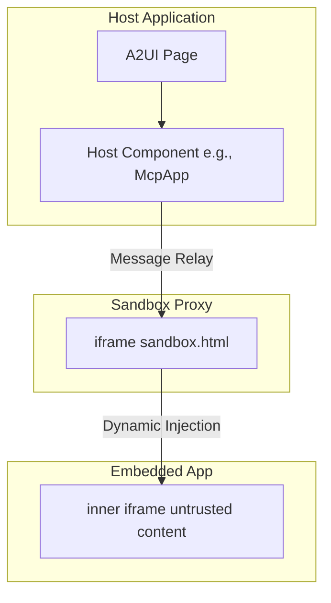
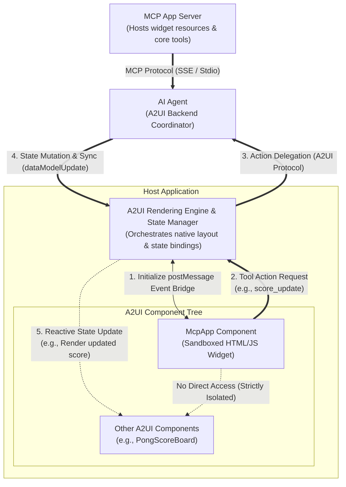
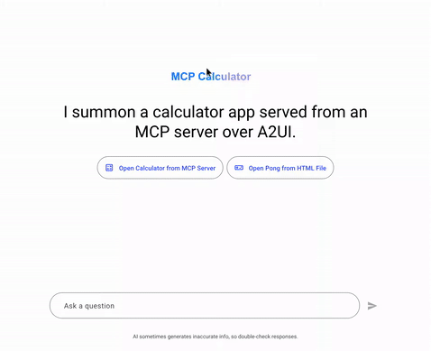
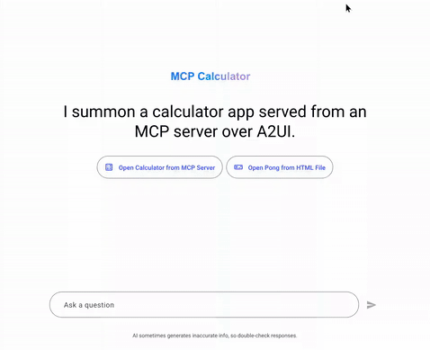

# 在 A2UI Surface 中集成 MCP Apps

本指南說明如何將 **Model Context Protocol (MCP) Applications** 集成並顯示在 **A2UI** surface 中，同時介紹安全模型和測試指南。

> NOTE: 想了解核心 A2UI-over-MCP 協議？請參見 [A2UI over MCP](a2ui_over_mcp.md)，了解如何從 MCP tool call 傳回 A2UI JSON payload。

## 概覽

Model Context Protocol (MCP) 允許 MCP server 向 host 交付丰富、互動式、基於 HTML 的使用者介面。A2UI 提供了一個安全環境來執行這些第三方應用。


## 雙 iframe 隔離模式

為了安全執行不可信的第三方程式碼，A2UI 使用 **雙 iframe** 隔離模式。這種方式在維持結構化 JSON-RPC 通道的同時，將原始 DOM 注入與主應用隔離開。

### 安全理由

標準單 iframe sandbox 如果把 `allow-scripts` 與 `allow-same-origin` 組合使用，通常會被繞過，從而破壞容器化。任何帶有 `allow-scripts` 和 `allow-same-origin` 的 iframe 都可以透過程式化方式與父 DOM 互動，或移除自身的 sandbox 屬性來逃逸 sandbox。

為避免這種情況，A2UI 在執行第三方應用的內層 iframe 中嚴格排除 `allow-same-origin`。

### 架構

1.  **[Sandbox Proxy (`sandbox.html`)](../../../samples/client/shared/mcp_apps_inner_iframe/sandbox.html)**：從同源提供的中間 `iframe`。它在維持結構化 JSON-RPC 通道的同時，將原始 DOM 注入與主應用隔離。
    - 權限：不要在 host 模板中對它啟用 sandbox（例如 [`mcp-app.ts`](../../../samples/community/client/lit/mcp-apps-in-a2ui-sample/mcp-app.ts) 或 [`mcp-apps-component.ts`](../../../samples/community/client/lit/mcp-apps-in-a2ui-sample/ui/custom-components/mcp-apps-component.ts)）。
    - Host origin 驗證：驗證訊息來自預期的 host origin。
2.  **嵌入式應用（內層 iframe）**：最內層的 `iframe`。透過 `srcdoc` 動態注入，並使用受限權限。
    - 權限：`sandbox="allow-scripts allow-forms allow-popups allow-modals"`（**絕不能** 包含 `allow-same-origin`）。
    - 隔離：由於唯一 origin，移除對 `localStorage`、`sessionStorage`、`IndexedDB` 和 cookie 的存取。

### 物理 iframe 嵌套



### 端到端架構與生命周期流程

完整周期（包括佈局樹層級、完全分離的後端參與者 Proxy Agent 與 MCP Server，以及隔離的第三方 widget 如何與其原生 sibling（例如 Pong 遊戲計分板）回應式互動）如下所示：



#### Sibling 更新循環如何工作：

1. **初始化 postMessage Event Bridge (1)**：Host shell 實例化雙 iframe sandbox，並與 `McpApp` 元件建立安全的訊息轉發橋。
2. **工具操作請求 (2)**：當使用者與 sandbox 中的 app 互動（例如在 Pong 遊戲中得分）時，app 會透過 postMessage bridge 送出訊息來觸發 tool action。
3. **Action Delegation (3)**：Host layout engine 攔截該 action，並透過 A2UI/A2A 協議將執行委托給 `AI Proxy Agent`。如果需要外部計算或資源，agent 可選擇使用標準 MCP Protocol（SSE / Stdio）與 `MCP App Server` 協調。
4. **狀態變更與同步 (4)**：Agent 處理 action，修改主 session state，並將 `dataModelUpdate` 推回 host state manager。
5. **Reactive State Update (5)**：Host 更新本機 store，觸發繫結到該 state path 的 sibling A2UI 元件（如原生計分板或顯示元件）回應式更新。為了維持容器化安全，sandboxed component 與原生 sibling 元素之間的直接通訊會被嚴格阻斷。

## 使用方式 / 程式碼範例

MCP Apps 元件通常會解析為 A2UI catalog 中的 `custom` node。下面展示開發者可能如何在程式碼中使用它。

### 1. 在 Catalog 中注冊

必須在你的 catalog 應用中注冊該元件。例如，在 Angular 中：

```typescript
import {Catalog} from '@a2ui/web_core/v0_9';
import {z} from 'zod';
import {McpApp} from './mcp-app';
import {Button} from './button';
import {Snackbar} from './snackbar';

const McpAppSchema = z.object({
  content: z.union([z.string(), z.object({id: z.string()})]).optional(),
  allowedTools: z.array(z.string()).optional(),
  title: z.string().optional(),
});

export const DEMO_CATALOG = new Catalog(
  'my_app.org/some_catalog.json',
  [
    {name: 'McpApp', component: McpApp, schema: McpAppSchema},
    {
      name: 'Button',
      component: Button,
      schema: z.object({
        label: z.string(),
        action: z.any().optional(),
      }),
    },
    {
      name: 'Snackbar',
      component: Snackbar,
      schema: z.object({
        message: z.string(),
        durationMs: z.number().default(3000),
      }),
    },
  ]
);
```

### 2. 在 A2UI 訊息中使用

在 Host 或 Agent 上下文中，送出一條會轉換為該 custom node 的 A2UI 訊息。

```json
{
  "type": "custom",
  "name": "McpApp",
  "properties": {
    "content": "<h1>Hello, World!</h1>",
    "title": "My MCP App"
  }
}
```

如果內容複雜或需要編碼，可以傳入 URL 編碼字符串：

```json
{
  "type": "custom",
  "name": "McpApp",
  "properties": {
    "content": "url_encoded:%3Ch1%3EHello%2C%20World!%3C%2Fh1%3E",
    "title": "My MCP App"
  }
}
```

## 通訊協議

Host 與嵌入的內層 iframe 之間透過 `postMessage` 上的結構化 JSON-RPC 通道通訊。

- **Events**：Host Component 監聽來自 proxy 的 `SANDBOX_PROXY_READY_METHOD` 訊息。
- **Bridging**：`AppBridge` 負責訊息轉發。開發者（具體來說是不可信 iframe 內的 MCP App Developer）可以使用 `bridge.callTool()` 呼叫 MCP server 上的 tool。
- **The Host**：解析回調（例如具體 resize、Tool result）。

### 限制

由於最內層 iframe 嚴格省略了 `allow-same-origin`，適用以下條件：

- MCP app **不能** 使用 `localStorage`、`sessionStorage`、`IndexedDB` 或 cookie。每個應用都執行在唯一 origin 下。
- 父級無法直接操作 DOM。所有互動都必須透過訊息傳遞進行。

## 前置條件

要執行範例，請確保已安裝：

- **Python 3.10+** — agent 與 MCP server 後端所需
- **[uv](https://docs.astral.sh/uv/)** — 快速 Python 包管理器（用於執行所有 Python 範例）
- **Node.js 18+** 和 **Yarn** — 在此 monorepo workspace 中建構和執行範例客戶端應用所需
- **`GEMINI_API_KEY`** — 所有基於 ADK 的 agent 都需要。可從 [Google AI Studio](https://aistudio.google.com/apikey) 取得

> [!NOTE]
> **套件管理工具說明：** 在 A2UI 儲存庫內執行內建的範例應用程式，需要透過 Corepack workspaces 設定的 Yarn。若是你自己一般的日常使用或此儲存庫之外的獨立專案，請使用你偏好的套件管理工具（例如 npm、pnpm）。

> ⚠️ **環境變量設定**：你可以在 shell 中 export `GEMINI_API_KEY`，也可以在每個 agent 目錄中建立 `.env` 檔案。Agent 會使用 `dotenv` 自動加載 `.env` 檔案。
>
> ```bash
> # Option 1: Export in shell
> export GEMINI_API_KEY="your-api-key-here"
>
> # Option 2: Create .env file in the agent directory
> echo 'GEMINI_API_KEY=your-api-key-here' > .env
> ```

## 範例

有兩個主要範例展示 MCP Apps 集成。每個範例都需要執行 **多個終端**：每個後端服務一個，客戶端一個。

---

### 範例 1：MCP App Standalone Sample（Lit Client 與 ADK Agent）

此範例使用基於 Lit 的客戶端和基於 ADK 的 A2A agent 來驗證 sandbox。

#### 第 1 步：啟動 Agent

在獨立終端中進入 agent 目錄並啟動 agent：

```bash
cd samples/agent/adk/mcp-apps-in-a2ui-sample
uv run agent.py
```

Agent 會執行在 `http://localhost:8000`。

#### 第 2 步：啟動客戶端

在新終端中進入客戶端目錄並啟動 dev server（需要先建構 Lit renderer）：

```bash
cd samples/client/lit/mcp-apps-in-a2ui-sample
yarn install
yarn dev
```

客戶端啟動在 `http://localhost:5173/`。

#### 第 3 步：在瀏覽器中開啟

開啟瀏覽器並存取 `http://localhost:5173/`。你應該會看到加載 MCP App 的 A2UI 介面。

**預期結果**：頁面會在 sandboxed iframe 中加載 MCP App。點擊 iframe 內的 “Call Agent Tool” 按鈕會觸發一個由 agent 處理的 action。

---

### 範例 2：MCP Apps（計算器 + Pong）（Angular 客戶端 + MCP Server + Proxy Agent）

此範例使用基於 Angular 的客戶端、MCP Proxy Agent 和遠程 MCP Server 來驗證 sandbox。它需要 **三個** 後端進程。

#### 第 1 步：啟動 MCP Server（Calculator）

```bash
cd samples/community/mcp/mcp-apps-calculator/
uv run .
```

MCP server 使用 SSE transport 啟動在 `http://localhost:8000`（如果 8000 已被占用，則會啟動在其他 port，例如可執行 `uv run . --port 8001`）。

#### 第 2 步：啟動 MCP Apps Proxy Agent

在 **新終端** 中：

```bash
cd samples/community/agent/adk/mcp_app_proxy/
export GEMINI_API_KEY="your-key"  # or use a .env file
uv run .
```

Proxy agent 預設啟動在 `http://localhost:10006`。

#### 第 3 步：建構並啟動 Angular 客戶端

首先，在 **儲存庫根目錄** 執行 `yarn build:all` 來建構 renderer package：

```bash
# Run at repository root
yarn build:all
```

接著，在 **新終端** 中進入客戶端目錄、安裝本機依賴，並啟動應用程式（會自動打包 sandbox iframe proxy 並啟動開發伺服器）：

```bash
# Navigate to the client directory
cd samples/community/client/angular/

# Install local dependencies
yarn install

# Start the app and bundle sandbox
yarn start mcp_calculator
```

> ⚠️ **必須執行 `yarn build:all`**：`yarn build:all` 會編譯 Angular app 依賴的 A2UI renderer package。執行 `yarn start mcp_calculator` 時，會在啟動伺服器之前自動把 sandbox proxy 打包進 Angular 專案的 public assets。

客戶端啟動在 `http://localhost:4200/`。

#### 第 4 步：在瀏覽器中開啟

存取：

```
http://localhost:4200/?disable_security_self_test=true
```

**預期結果**：頁面會渲染一組 smart chip，用於加載 calculator app 或 pong app。兩個 app 都執行在各自的 sandboxed iframe 中。

|                                                 Calculator App                                                 |                                 Pong App                                  |
| :------------------------------------------------------------------------------------------------------------: | :-----------------------------------------------------------------------: |
|  |  |

---

## 測試用 URL 選項

出於測試目的，可以透過特定 URL 查詢參數跳過安全自檢。

### `disable_security_self_test=true`

該查詢參數允許繞過驗證 iframe 隔離的安全自檢。對於雙 iframe 設定可能無法透過嚴格 origin 檢查的調試和測試環境（例如 `localhost` 開發），這很有用。

範例：

```
http://localhost:4200/?disable_security_self_test=true
```

## 故障排查

| 問題                                              | 解決方案                                                                                         |
| ------------------------------------------------- | ------------------------------------------------------------------------------------------------ |
| `GEMINI_API_KEY environment variable not set`     | export 該 key，或在 agent 目錄中新增 `.env` 檔案                                                 |
| Python version error on `restaurant_finder` agent | 安裝 Python 3.13+（該範例的 `pyproject.toml` 要求）                                             |
| `yarn build:renderer` fails                       | 確保已先在 `samples/client/lit/` 中執行 `yarn install`                                          |
| Angular client shows blank page                  | 確保在 `yarn start` 前執行了 `yarn build:sandbox`                                               |
| MCP app iframe doesn't load                      | 檢查 MCP server（端口 8000）和 proxy agent（端口 10006）是否都在執行                            |
| `ng serve` not found                              | 執行 `yarn install` 安裝包含 `@angular/cli` 在內的 dev dependencies                              |
| "URL with hostname not allowed"                   | Angular 21 會限制 allowed hosts。使用 `localhost`（預設值），不要傳 `--host 0.0.0.0`             |
| Security self-test fails in dev                  | 在 URL 中新增 `?disable_security_self_test=true`                                                |
