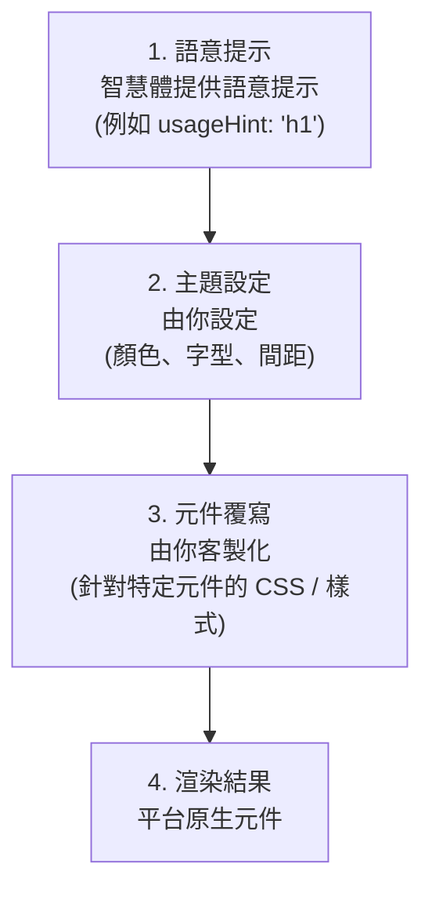

# 主題與樣式

自訂 A2UI 元件的外觀與風格，使其符合你的品牌。

## A2UI 的樣式設計理念

A2UI 採用 **由客戶端控制樣式** 的方式：

- **智慧體描述要顯示什麼**（元件與結構）
- **客戶端決定它看起來如何**（顏色、字型、間距）

這能確保：

- ✅ **品牌一致性**：所有 UI 都符合你的應用設計系統
- ✅ **安全性**：智慧體無法注入任意 CSS 或樣式
- ✅ **無障礙**：由你控制對比、focus 狀態與 ARIA 屬性
- ✅ **平台原生體驗**：Web 看起來像 Web，行動端看起來像行動端

## 樣式層次

A2UI 的樣式分成多層運作：



## 第 1 層：語意提示

智慧體提供的是語意提示（不是視覺樣式），用來引導客戶端進行渲染：

```json
{
  "id": "title",
  "component": {
    "Text": {
      "text": {"literalString": "Welcome"},
      "usageHint": "h1"
    }
  }
}
```

**常見的 `usageHint` 值：**

- Text：`h1`、`h2`、`h3`、`h4`、`h5`、`body`、`caption`
- 其他元件也有自己的提示值（請參閱 [元件參考](../reference/components.md)）

客戶端渲染器會根據你的主題與設計系統，把這些語意提示對映成實際的視覺樣式。

## 第 2 層：主題設定

每個渲染器都提供方式，讓你全域設定自己的設計系統，包含：

- **顏色**：主色、次色、背景、表面、錯誤、成功等
- **字體排版**：字體家族、大小、粗細、行高
- **間距**：基礎單位與尺度（xs、sm、md、lg、xl）
- **形狀**：圓角值
- **層次**：表現深度的陰影樣式

TODO：補充各平台的主題設定指南：

**Web（Lit）：**

- 如何在初始化渲染器時設定主題
- 可用的主題屬性

**Angular：**

- 與 Angular Material 主題系統整合
- 獨立的 A2UI 主題設定

**Flutter：**

- A2UI 如何使用 Flutter 的 `ThemeData`
- 自訂主題屬性

**參考可運作的示例：**

- [Lit 範例](https://github.com/a2ui-project/a2ui/tree/main/samples/client/lit)
- [Angular 範例](https://github.com/a2ui-project/a2ui/tree/main/samples/client/angular)
- [Flutter GenUI 文件](https://docs.flutter.dev/ai/genui)

## 第 3 層：元件覆寫

除了全域主題設定之外，你也可以針對特定元件覆寫樣式：

**Web 渲染器：**

- 用 CSS 自訂屬性（CSS variables）做更細緻的控制
- 用標準 CSS 選擇器覆寫特定元件樣式

**Flutter：**

- 透過 `ThemeData` 覆寫特定 widget 的主題

TODO：補充各平台的詳細元件覆寫示例。

## 常見樣式能力

### 深色模式

A2UI 渲染器通常支援依系統偏好自動切換深色模式：

- 自動偵測系統主題（`prefers-color-scheme`）
- 手動切換明亮 / 深色主題
- 自訂深色主題設定

TODO：補充深色模式設定示例。

### 回應式設計

A2UI 元件預設具備回應式能力。你也可以進一步自訂回應式行為：

- 針對不同螢幕尺寸的媒體查詢
- 元件層級的容器查詢
- 回應式間距與字體排版尺度

TODO：補充回應式設計示例。

### 自訂字型

在你的 A2UI 應用中載入並使用自訂字型：

- Web fonts（Google Fonts 等）
- 自行託管的字型
- 各平台專屬的字型載入方式

TODO：補充自訂字型示例。

## 最佳實務

### 1. 使用語意提示，而不是視覺屬性

智慧體應提供語意提示（`usageHint`），而不是視覺樣式：

```json
// ✅ 好：語意提示
{
  "component": {
    "Text": {
      "text": {"literalString": "Welcome"},
      "usageHint": "h1"
    }
  }
}

// ❌ 不好：視覺屬性（不支援）
{
  "component": {
    "Text": {
      "text": {"literalString": "Welcome"},
      "fontSize": 24,
      "color": "#FF0000"
    }
  }
}
```

### 2. 維持無障礙

- 確保足夠的色彩對比（WCAG AA：一般文字 4.5:1，大字 3:1）
- 使用螢幕閱讀器測試
- 支援鍵盤操作
- 在明亮與深色模式下都進行測試

### 3. 使用設計令牌

定義可重用的設計令牌（顏色、間距等），並在整體樣式中統一引用，以保持一致性。

### 4. 跨平台測試

- 在所有目標平台（web、mobile、desktop）上測試主題樣式
- 驗證明亮與深色模式
- 檢查不同螢幕尺寸與方向
- 確保跨平台都有一致的品牌體驗

## 下一步

- **[自訂元件](authoring-components.md)**：用你的樣式來建立自訂元件
- **[元件參考](../reference/components.md)**：查看所有元件的樣式選項
- **[客戶端設定](client-setup.md)**：在你的應用中設定渲染器
